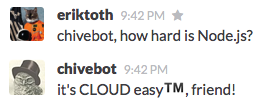
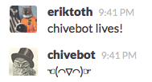

### chivebot

A pluggable slack bot based on Outgoing WebHooks.






#### Creating a custom bot
First, declare your dependencies
```bash
$ mkdir fembot && cd fembot
$ npm init

# ...

$ npm install --save chivebot
# also any additional plugins, e.g.
#   $ npm install --save chivebot-weather
#   $ npm install --save chivebot-coolfaces

# create the config file
$ touch config.json
# configure server (see below)
$ npm start
```

Then define a start script in your package.json
```js
"scripts": {
  "start": "hapi -c config.json"
}
```

Then configure your server and plugins.
```json
{
    "servers": [
        {
            "host": "0.0.0.0",
            "port": "8000"
        }
    ],
    "plugins": {
        "chivebot-coolfaces": {},
        "chivebot-weather": {},
        "chivebot": {
            "trigger_word": "my_bot",
            "user_name": "my_bot",
            "token": "{webhook_token}"
        }
    }
}
```

#### Options
- `user_name` (*String*) - The username set for the bot. This is important as it filters messages such that the bot doesn't respond to itself.
- `token` (*String*) - The outgoing webhook token as provided by slack.
- `trigger_word` (*String*, optional) - If you configured a trigger word in slack, set it here so the messge text can be parsed correctly.


#### Plugins
Unfortunately, there's currently a lot of boilerplate with plugins. The simplest example of a plugin module can be found
in [chivebot-coolfaces](https://github.com/totherik/chivebot-coolfaces). The important part is that `chivebot` exports a
`registerCommand` API in which you register the command you want to trigger this plugin, along with the handler:

```javacsript
// When someone types `chivebot lives!` replay with a cool ascii face ᕙ(⇀‸↼‶)ᕗ
plugin.plugins.chivebot.registerCommand('lives!', function (raw, args, cb) {
    cb(null, cool());
});
```

The handler arguments are:
- `raw` - the raw POST body as sent by Slack
- `args` - the message, argv parsed. So `chivebot activate -c="Hello, world" -b arg2` becomes `['chivebot', 'activate', '-c="Hello, world"', '-b', 'arg2']` which can then be handed off to a parser like `minimist`.
- `cb` - the callback for pass back the desired response with the signature `function (err, text) {}`
